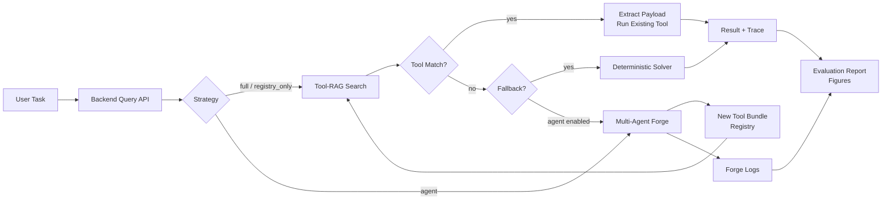
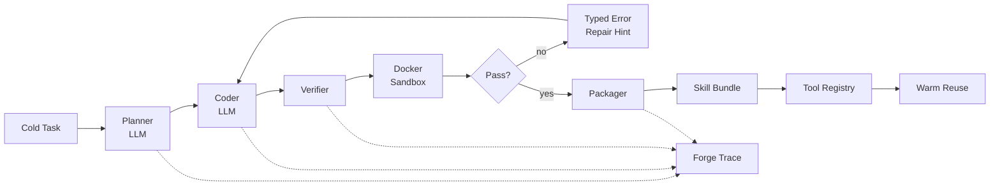
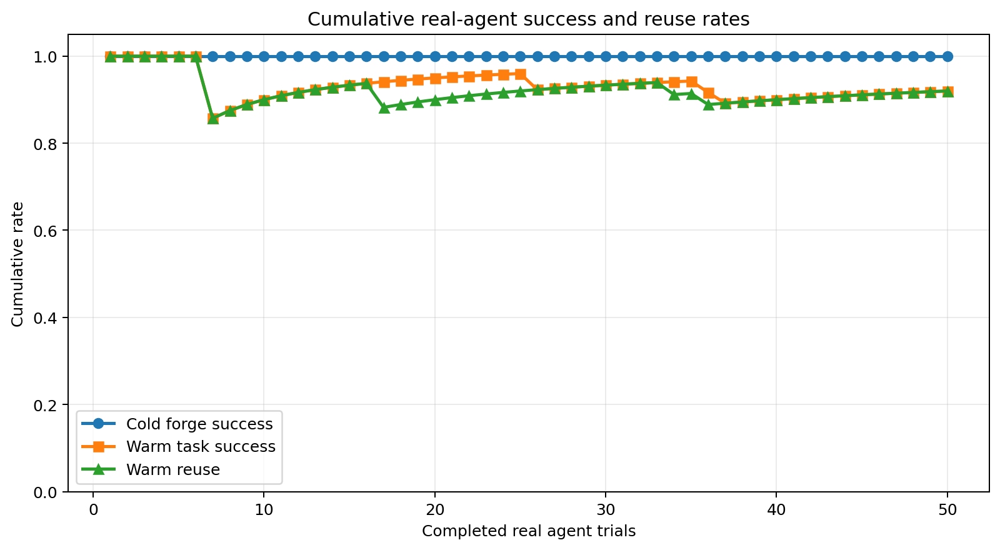
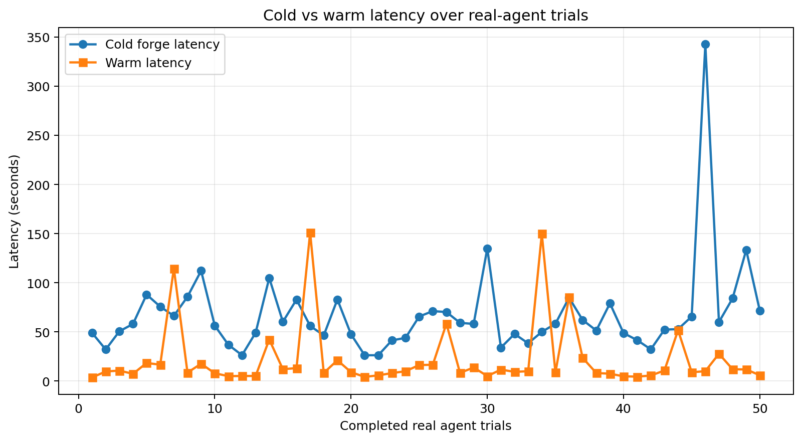
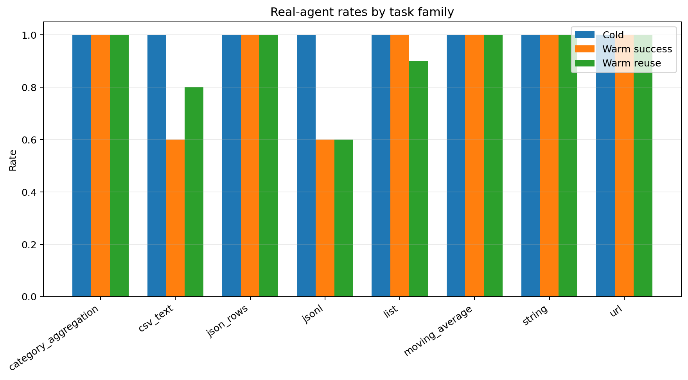
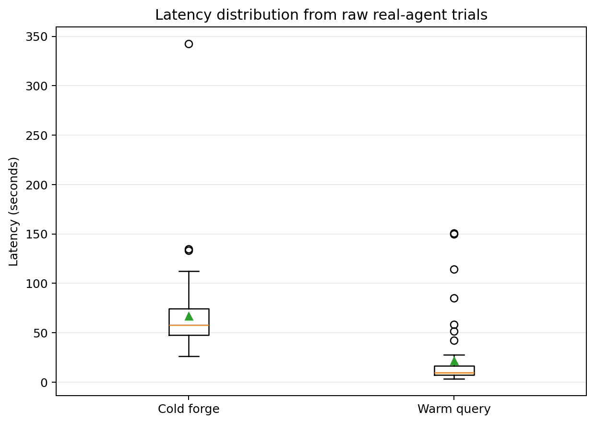
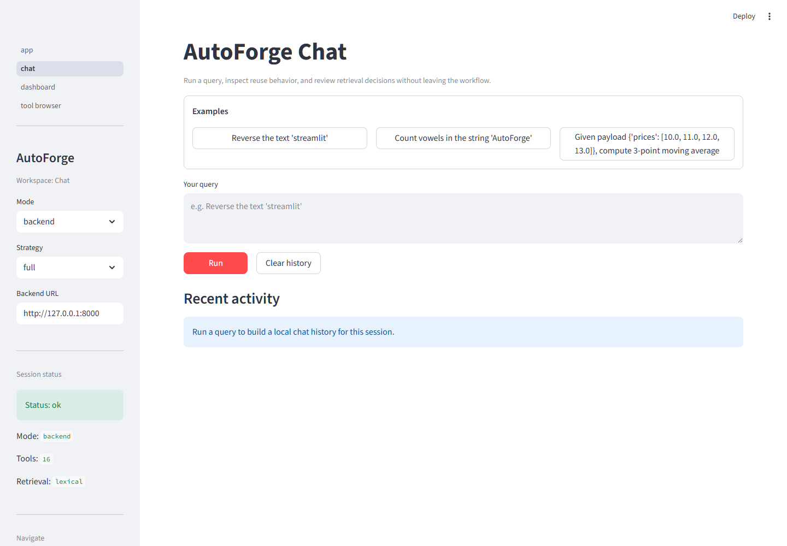
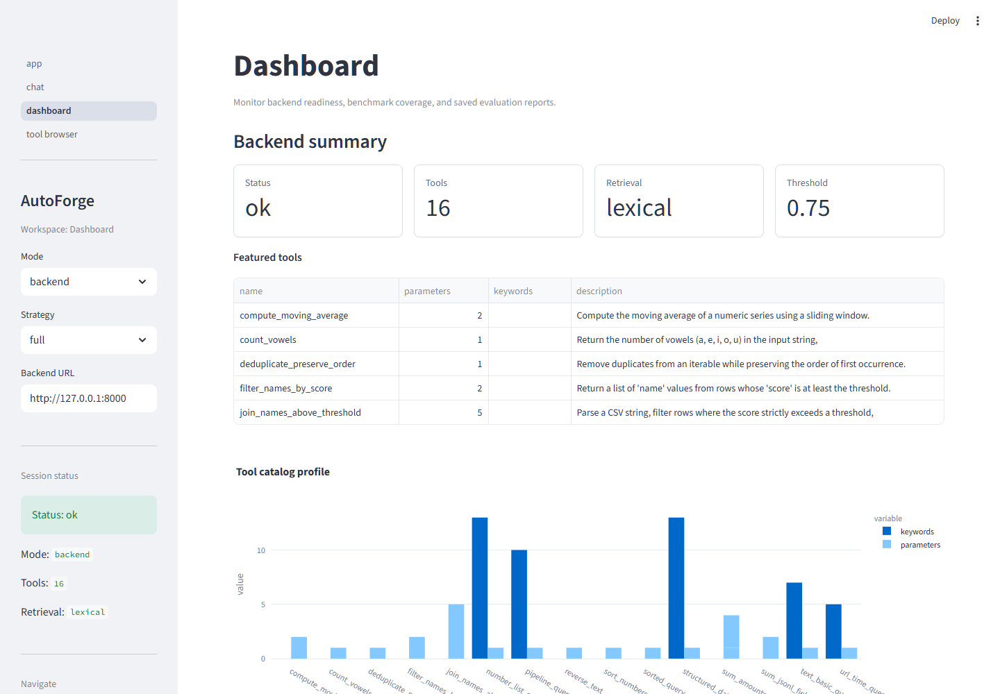
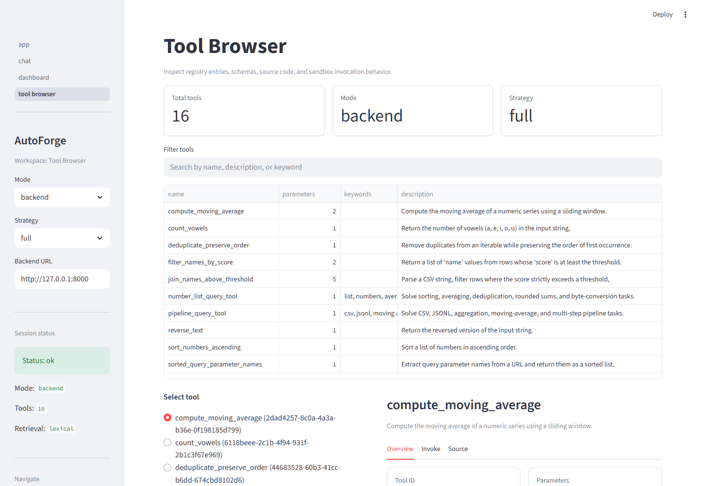
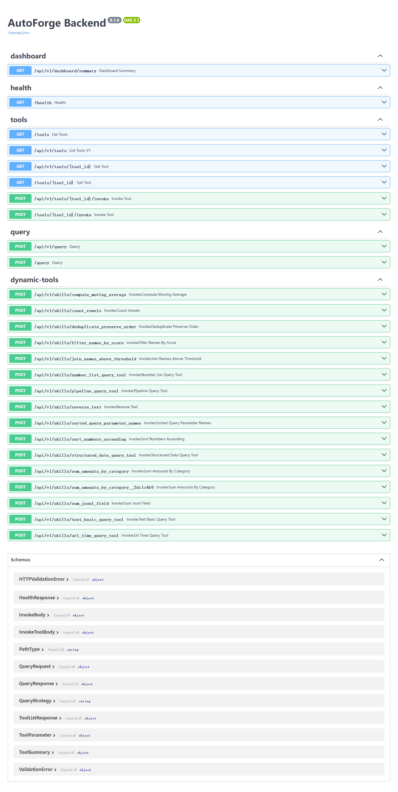

# AutoForge: A Self-Evolving Multi-Agent System for Reusable Tool Creation

**Course:** COMP7608A Large Language Models  
**Project Report**  
**Repository:** https://github.com/SeanLIUXQ/autoforge

| Name | Student ID | Primary Responsibility |
|---|---:|---|
| Liu Xinquan | 3036659637 | Agent logic and algorithms; real LLM tool forging; Docker sandbox evidence |
| Cheung Yu Lung | 3035477616 | Backend API, Tool-RAG retrieval, query strategies, dynamic routes, and MCP helper |
| Lyu Linze | 3036658619 | Frontend, benchmark data, evaluation dashboard, visualization, and report assets |

## Abstract

AutoForge is an LLM-powered agentic tool system that investigates whether language models can move beyond one-off code generation and accumulate reusable, verifiable tools over time. The system first uses Tool-RAG to retrieve existing tools from a registry. If no suitable tool is found, a multi-agent forge pipeline plans, writes, verifies, packages, and stores a new Python tool. The generated tool is then available for subsequent warm queries through the normal retrieval path. AutoForge combines a FastAPI backend, Streamlit frontend, tool registry, dynamic tool routes, MCP-compatible helpers, sandboxed execution, benchmark evaluation, and real LLM agent experiments. We evaluate the system with a 320-query benchmark, live backend strategy comparisons, retrieval-threshold sweeps, Docker sandbox evidence, and 50 real DeepSeek `deepseek-v4-pro` cold/warm agent trials. The backend `full` strategy achieved 100% success on the 320-query live benchmark with 40.63% tool reuse, while the real agent experiment achieved 50/50 cold forge success and 46/50 warm reuse. These results provide empirical evidence that reusable tool accumulation is feasible for deterministic automation tasks, while also showing that warm reuse remains sensitive to retrieval quality, payload extraction, schema alignment, and strict output formatting.

## 1. Introduction and Motivation

Large language models can understand natural language and generate useful code, but many LLM applications still behave as one-shot problem solvers. When a user asks for a data transformation, string operation, or small automation script, a code-capable LLM can often produce a temporary solution. However, that code is usually discarded after the interaction. A semantically similar future query may trigger another full code-generation process, paying the latency and token cost again while also introducing new opportunities for hallucination or execution failure.

This creates a gap between **code generation** and **tool accumulation**. Tool-augmented agents are powerful when the correct tool already exists, but their toolset is usually manually defined. Code agents can create new procedures on demand, but they do not automatically turn successful code into a reusable, discoverable, and safe tool. AutoForge is designed around this gap.

The project asks the following research-style question:

> Can an LLM agent automatically forge, verify, store, and later reuse deterministic tools, so that recurring tasks shift from expensive cold code generation to cheaper warm retrieval and execution?

Our core hypothesis is that a tool cache backed by retrieval can convert recurring tasks from repeated LLM generation into tool lookup plus sandboxed execution. This matters for practical automation tasks such as CSV parsing, JSON processing, URL analysis, list operations, aggregation, and small ETL-style transformations. It also connects directly to COMP7608A topics: LLM agents, tool use, retrieval-augmented generation, code generation, safety, evaluation, and deployment.

## 2. Project Idea

AutoForge treats generated tools as persistent system assets rather than temporary code snippets. The intended loop is:

1. A user submits a natural-language task.
2. The backend searches the existing tool registry using Tool-RAG.
3. If a confident match exists, AutoForge extracts structured arguments and runs the matched tool.
4. If no match exists, the multi-agent forge path creates a new tool.
5. The generated code is verified in a sandbox.
6. If verification passes, the tool is packaged with source code, schema, metadata, README, and example input.
7. Future similar tasks can retrieve and reuse the new tool.

This gives AutoForge a concrete form of long-term capability growth. Each successful cold forge can become future warm-path capacity.

The system is not intended to be a general autonomous coding assistant. We deliberately focus on deterministic, tool-like tasks where expected outputs can be evaluated and where generated functions can be sandboxed. This scope makes the project narrow enough to evaluate rigorously while still demonstrating an important agentic pattern: **LLM generation plus persistent tool memory**.

## 3. Course Topic Alignment

AutoForge covers several major course themes.

| Course Topic | AutoForge Implementation |
|---|---|
| LLM-powered agents | Planner, Coder, Verifier, and Packager pipeline orchestrated through `agents/forge_pipeline.py`. |
| Tool use | Tools are represented through schemas, metadata, source files, direct invocation, and dynamic API routes. |
| Retrieval-Augmented Generation | Tool-RAG retrieves capabilities from a registry rather than retrieving documents. |
| Code generation | The Coder agent generates reusable Python functions rather than one-off answers. |
| Evaluation | We measure success rate, tool reuse rate, latency, speedup, threshold behavior, and failure types. |
| Safety | Generated code is checked by AST guards, timeouts, local sandboxing, and Docker sandboxing. |
| Deployment | FastAPI, Streamlit, dynamic routes, and MCP-compatible helpers expose the system to users and external clients. |

## 4. System Design and Implementation

### 4.1 Overall Architecture

AutoForge has four main layers:

- **User and API layer:** Streamlit frontend and FastAPI backend receive natural-language requests.
- **Tool-RAG fast path:** Existing tools are retrieved from a registry and executed when confidence is high enough.
- **Agent forge slow path:** When no tool is available, a multi-agent pipeline creates and verifies a new tool.
- **Tool distribution layer:** Packaged tools are stored in skill bundles, surfaced through the backend, and exposed through MCP-compatible helpers.

The system-level routing is shown below.



### 4.2 Tool-RAG and Query Strategies

AutoForge uses Tool-RAG to match a user query against tool metadata, descriptions, parameter names, keywords, and schemas. The current live backend uses lexical retrieval with intent-aware preprocessing, and the project also includes optional vector-store support. Each retrieval produces a `retrieval_trace` so that the system can explain which tools were considered, what score they received, and why they were accepted or rejected.

The backend supports four strategies:

| Strategy | Behavior | Purpose |
|---|---|---|
| `full` | Retrieve first; execute matched tool; fallback or forge on miss. | Main system behavior. |
| `no_retrieval` | Skip retrieval and use slow/fallback path. | Baseline without reuse. |
| `registry_only` | Retrieve and execute only; no fallback. | Measures registry coverage. |
| `agent` | Force the LLM forge path. | Demonstrates cold tool creation. |

This design allows the evaluation to separate correctness, reuse, and coverage. In particular, `registry_only` is expected to fail on tasks not covered by the registry; this is useful because it exposes the boundary of the current tool catalog.

### 4.3 Multi-Agent Tool Forge

The internal forge pipeline contains four stages.

| Stage | Responsibility |
|---|---|
| Planner | Converts the user request into implementation steps and a proposed function name. |
| Coder | Generates a reusable Python function from the plan. |
| Verifier | Runs generated code on multiple near-input cases inside the sandbox. |
| Packager | Extracts schema and metadata, then writes a reusable skill bundle. |

The internal multi-agent pipeline is shown below.



The planner and coder are LLM-driven agents, while the verifier and packager are deterministic control agents. This division is important: the LLM is used for creative program synthesis, but acceptance and packaging are controlled by reproducible code. If verification fails, the system feeds typed error information back to the coder, allowing repair attempts within a bounded retry loop.

### 4.4 Sandbox and Safety

Generated code is risky if executed without controls. AutoForge mitigates this risk through:

- AST parsing before execution.
- Rejection of banned imports such as `os`, `sys`, `subprocess`, `socket`, `shutil`, and `pathlib`.
- Rejection of banned calls such as `open`, `eval`, `exec`, `compile`, `input`, and `__import__`.
- Timeout handling.
- JSON-serializable output checks.
- Optional Docker execution with `--network none`, read-only filesystem mode, CPU limits, memory limits, and process limits.

For the real LLM agent experiment, Docker sandboxing was enabled with image `autoforge-sandbox:latest`. We also saved an explicit safety verification record:

| Check | Result | Evidence |
|---|---|---|
| Safe function execution | Passed | `safe_add` returned `5`. |
| File access rejection | Passed | `open()` was rejected as `unsafe_call`. |
| Unsafe import rejection | Passed | `os` import was rejected as `unsafe_import`. |

This evidence is stored in `docs/report/real_agent_evidence/docker_sandbox/docker_sandbox_verification.json`, making the sandbox claim reproducible rather than purely descriptive.

### 4.5 API, MCP, and Frontend

The backend exposes health, tool listing, tool inspection, and query endpoints through FastAPI. Newly packaged tools can also be registered as dynamic tool routes, so generated tools behave more like deployable services than temporary snippets.

The MCP-compatible helper exposes catalog listing, direct tool invocation, and natural-language querying. Verification showed a non-empty catalog, successful direct invocation, and successful natural-language query routing. In the MCP helper verification, a reverse-text query returned `tilmaerts` through the fast path with `reused_existing_tool = true`.

The Streamlit frontend contains three main pages:

- **Chat:** submit natural-language queries and inspect path, latency, reused tool, and retrieval trace.
- **Tool Browser:** inspect registered tool schemas, parameters, source code, and direct invocation behavior.
- **Dashboard:** view backend status, benchmark reports, strategy comparisons, cold/warm metrics, per-family performance, and failure cases.

Screenshots used as evidence are saved under `docs/report/real_agent_evidence/screenshots/`.

## 5. Benchmark and Evaluation Protocol

### 5.1 Benchmark Dataset

The main benchmark contains 80 canonical tasks and 240 paraphrases, giving 320 evaluation queries per strategy. The dataset is balanced across four difficulty levels.

| Difficulty | Canonical Samples | Paraphrases | Focus |
|---|---:|---:|---|
| L1 | 20 | 60 | String operations, list operations, basic math, and unit conversion |
| L2 | 20 | 60 | JSON processing, URL parsing, timestamps, table filtering, and text grouping |
| L3 | 20 | 60 | CSV-like text, JSONL, aggregation, moving average, and multi-step processing |
| L4 | 20 | 60 | Longer inputs, complex filtering, aggregation, and multi-step ETL |

The benchmark covers 17 tool families, including string operations, list operations, math, JSON processing, URL processing, CSV pipelines, JSONL pipelines, aggregation, table filtering, datetime operations, text ETL, and unit conversion.

The protocol separates:

- **Cold pass:** canonical queries, representing first-time tasks.
- **Warm pass:** paraphrases, representing semantically similar repeat tasks.

This separation is central to AutoForge because the project is not only about solving tasks, but also about whether capabilities can be reused later.

### 5.2 Metrics

The evaluation reports the following metrics:

| Metric | Meaning |
|---|---|
| Success Rate | Fraction of outputs matching expected ground truth. |
| Tool Reuse Rate / TRR | Fraction of queries served by a reused tool. |
| Error Rate | Fraction of queries with execution errors or explicit system failures. |
| Mean Latency | Average end-to-end latency. |
| Speedup Ratio | Mean slow-path latency divided by mean fast-path latency. |
| Path Distribution | Number of fast, slow, fallback, or agent-path queries. |
| Per-family Success | Performance grouped by task family. |
| Failure Type | Categorized cause of failure or mismatch. |

### 5.3 Evaluation Runs

We used several complementary evaluations:

- **Mock strategy comparison:** deterministic evaluation of strategy behavior.
- **Live backend benchmark:** real backend execution over 320 queries.
- **Threshold sweep:** retrieval threshold sensitivity analysis.
- **Real LLM agent demo:** 50 real DeepSeek cold/warm trials with Docker sandboxing.
- **MCP helper verification:** checks that external tool exposure works.
- **Unit tests:** full repository tests passed after the final modifications.

## 6. Evaluation Results

### 6.1 Live Backend Benchmark

The live backend benchmark was run on 320 queries per strategy. The key results are:

| Strategy | Success Rate | Tool Reuse Rate | Error Rate | Speedup | Path Distribution |
|---|---:|---:|---:|---:|---|
| `full` | 1.0000 | 0.4063 | 0.0000 | 1.1777 | 130 fast / 190 slow |
| `no_retrieval` | 1.0000 | 0.0000 | 0.0000 | 0.0000 | 320 slow |
| `registry_only` | 0.4063 | 0.4063 | 0.5938 | 0.0275 | 130 fast / 190 rejected or slow-like failures |

The `full` strategy is the main system configuration. It achieved perfect correctness on this deterministic benchmark while reusing tools for 130 out of 320 queries. The `no_retrieval` baseline also achieved perfect correctness but had no reuse by design. The `registry_only` result shows the current registry coverage limit: when fallback is disabled, all retrieval misses become failures.

This comparison supports a balanced interpretation. Tool-RAG is useful because it can serve a meaningful portion of queries through the fast path, but fallback or forging remains necessary for complete coverage. In other words, retrieval improves efficiency when the registry already contains the relevant capability, whereas the slow path preserves coverage when the registry is incomplete.

### 6.2 Threshold Sweep

The threshold sweep tested how retrieval aggressiveness affects path decisions.

| Threshold | Success Rate | Fast Rate | Slow Rate | Fast Incorrect Rate |
|---:|---:|---:|---:|---:|
| 0.55 | 1.0000 | 0.7000 | 0.3000 | 0.0000 |
| 0.65 | 1.0000 | 0.6500 | 0.3500 | 0.0000 |
| 0.75 | 1.0000 | 0.6250 | 0.3750 | 0.0000 |
| 0.85 | 1.0000 | 0.0000 | 1.0000 | 0.0000 |

Lower thresholds increase fast-path usage, while an overly strict threshold eliminates reuse. In this sweep, no fast incorrect cases were observed, suggesting that the current benchmark and retrieval setup are conservative enough for deterministic tasks. However, the sweep also shows that threshold selection has a direct effect on reuse rate. The system therefore faces a standard precision-recall trade-off: a lower threshold can improve reuse, but a production deployment would still need broader adversarial and out-of-distribution testing before relying on aggressive retrieval settings.

### 6.3 Real LLM Agent Experiment

The final real agent experiment used DeepSeek `deepseek-v4-pro` with Docker sandboxing. It repeated 10 representative demo cases for five rounds, producing 50 real cold/warm trials.

| Metric | Result |
|---|---:|
| Total real trials | 50 |
| Base cases | 10 |
| Repeats | 5 |
| Cold forge success | 50/50 |
| Cold forge success rate | 1.0000 |
| Warm task success | 46/50 |
| Warm task success rate | 0.9200 |
| Warm reuse | 46/50 |
| Warm reuse rate | 0.9200 |
| Duration | 74.85 minutes |
| Mean cold latency | 67.077 seconds |
| Mean warm latency | 21.991 seconds |

The repeat-level summary is:

| Repeat | Trials | Cold Forge | Warm Success | Warm Reuse |
|---:|---:|---:|---:|---:|
| 1 | 10 | 1.0 | 0.9 | 0.9 |
| 2 | 10 | 1.0 | 1.0 | 0.9 |
| 3 | 10 | 1.0 | 0.9 | 1.0 |
| 4 | 10 | 1.0 | 0.8 | 0.8 |
| 5 | 10 | 1.0 | 1.0 | 1.0 |

The family-level summary shows that `csv_text` and `jsonl` were the most fragile families:

| Family | Trials | Cold Forge | Warm Success | Warm Reuse |
|---|---:|---:|---:|---:|
| category_aggregation | 5 | 1.0 | 1.0 | 1.0 |
| csv_text | 5 | 1.0 | 0.6 | 0.8 |
| json_rows | 5 | 1.0 | 1.0 | 1.0 |
| jsonl | 5 | 1.0 | 0.6 | 0.6 |
| list | 10 | 1.0 | 1.0 | 0.9 |
| moving_average | 5 | 1.0 | 1.0 | 1.0 |
| string | 10 | 1.0 | 1.0 | 1.0 |
| url | 5 | 1.0 | 1.0 | 1.0 |

Figures generated from the raw JSON report are saved under `docs/report/real_agent_evidence/figures/`:



The cumulative-rate figure shows that cold forge success remained stable at 1.0 throughout the 50-trial run, while warm success and warm reuse converged to 0.92. This pattern indicates that the LLM-backed generation stage was not the dominant source of failure in this experiment. Instead, the remaining errors appeared after a tool had already been generated, during warm retrieval or argument extraction.



The latency trend illustrates the practical value of reuse. Mean cold latency was 67.077 seconds, compared with 21.991 seconds for warm execution, giving an approximate 3.05x latency reduction for warm queries. The fifth repeat had noticeably higher cold latency, which is consistent with variability from real LLM API calls. Warm latency was lower and more stable because it avoided most of the planner and coder generation workload.



The family-level figure shows that most task families reached perfect warm success and reuse, including string, URL, JSON row, aggregation, and moving-average tasks. The weaker families were `csv_text` and `jsonl`, both of which reached only 0.6 warm success. This suggests that serialized, literal-heavy input formats are harder for the current retrieval and payload extraction pipeline than compact structured inputs.



The latency distribution further separates cold and warm behavior. Cold trials had a wider spread because they depended on LLM planning, code generation, verification, and packaging. Warm trials were concentrated at lower latency values because they mainly required retrieval and execution. This supports the central design motivation of AutoForge: successful cold generation is expensive, but it can be amortized if later queries reuse the resulting tool.

### 6.4 Frontend and System Evidence

The live frontend and backend evidence includes:









These screenshots show that AutoForge is not only a script-based experiment. It includes a deployed backend, user-facing interface, dashboard, tool browser, and API documentation. This is important for the report because the evaluation evidence is tied to an executable system rather than an isolated notebook or offline simulation.

## 7. Key Observations

### 7.1 What Worked

The cold forge pipeline worked reliably in the real LLM experiment. Across 50 DeepSeek-backed trials, every cold query produced a sandbox-verified packaged tool. This suggests that the Planner-Coder-Verifier-Packager separation is effective for deterministic tool-like tasks, especially when creative generation is separated from deterministic verification.

Tool-RAG also worked as intended at the system level. The live backend `full` strategy reused tools for 40.63% of the 320 benchmark queries while preserving 100% success. This shows that retrieval can serve a meaningful portion of repeated or recognizable tasks without sacrificing correctness in the current benchmark.

The dashboard and trace design made the system easier to analyze. Retrieval traces, forge logs, failure types, and per-family summaries helped explain system behavior instead of only reporting final answers. This observability was especially useful for distinguishing generation failures from reuse failures.

Docker sandbox evidence strengthened the safety argument. The system showed that safe generated code can run, while unsafe file access and unsafe imports are rejected.

### 7.2 What Did Not Work

Warm reuse is harder than cold generation. Even when a generated tool passes verification, later reuse still depends on retrieval, schema matching, and payload extraction. In the 50-trial real agent experiment, four warm trials failed exact success or reuse. This means that tool creation and tool reuse should be treated as separate evaluation targets.

Literal-heavy formats such as CSV text and JSONL were the most fragile. These inputs contain many concrete values, punctuation marks, field names, and serialized records. Such payloads can make retrieval and argument extraction harder because the task intent is mixed with raw data.

Exact string output evaluation can be strict. For example, a semantically reasonable CSV output may fail exact matching because of spacing differences such as `"Ada, Cy"` versus `"Ada,Cy"`. This does not necessarily mean the generated tool misunderstood the task, but it does matter for deterministic evaluation and reportable benchmark results.

Registry-only execution is too strict for complete coverage. The `registry_only` strategy achieved 40.63% success because it intentionally disables fallback. This is useful as a coverage diagnostic, but not suitable as the main user-facing strategy.

### 7.3 What Surprised Us

The strongest surprise was that real cold forge performance was more stable than expected. We anticipated more LLM variability across 50 repeated generations, but the cold forge stage succeeded every time under Docker sandbox verification.

Another surprise was that the bottleneck moved from code generation to reuse orchestration. Once the agent can generate working functions, the next hard problem is making future natural-language requests invoke the right generated tool with the right structured payload.

Finally, threshold sensitivity was clearer than expected. A strict threshold of 0.85 removed fast-path reuse entirely in the sweep, while lower thresholds increased fast-path use without producing fast incorrect cases in this benchmark.

## 8. Limitations

AutoForge is still a proof-of-concept system. The benchmark focuses on deterministic tool-like tasks, so the conclusions should not be generalized to open-ended reasoning, interactive web tasks, or tasks requiring external side effects.

The 50 real agent trials do not replace a full 320-query `strategy=agent` benchmark. Because of time constraints and token-cost considerations, this experiment used 50 real agent tests and selected the latest domestic large language model, DeepSeek `deepseek-v4-pro`, as the base model. Future work will compare models from multiple LLM providers and evaluate which model family performs best within the AutoForge tool-forging workflow.

The current retrieval setup is mainly lexical in the live run. Optional vector retrieval exists, but the final reported backend run used lexical retrieval. Future work should compare lexical-only, vector-only, and hybrid retrieval more rigorously.

The sandbox rejects obvious unsafe imports and calls, but it is not a formal security proof. Production deployment would require stronger isolation, stricter dependency control, audit logging, and container-level policy enforcement beyond this course prototype.

## 9. Conclusion

AutoForge demonstrates a practical agentic pattern: an LLM can generate a new tool when needed, verify it, package it, and make it reusable through retrieval. The project combines Tool-RAG, multi-agent code generation, sandbox verification, tool packaging, FastAPI, MCP-compatible exposure, Streamlit visualization, and benchmark-driven evaluation.

The results support the core hypothesis in a qualified way. Tool reuse can reduce repeated generation and create a growing tool registry, but warm reuse is not automatic. It depends on retrieval quality, payload extraction, schema stability, and output normalization. The strongest result is the real LLM cold forge performance: 50/50 successful Docker-verified tool generations. The most important future direction is improving warm reuse robustness, especially for structured text formats such as CSV and JSONL.

Overall, AutoForge is best understood as a prototype of a self-evolving tool server for LLM agents: not merely a chatbot, and not merely a code generator, but a system that can accumulate verified capabilities over time.

## 10. Individual Contributions

| Member | Main Contribution |
|---|---|
| Liu Xinquan | Multi-agent forge pipeline, Planner/Coder/Verifier/Packager workflow, Docker sandbox evidence, real DeepSeek agent experiment, 50-trial agent result analysis. |
| Lyu Linze | Streamlit frontend, dashboard, benchmark dataset design, evaluation metrics, report assets, visualization and failure explorer. |
| Cheung Yu Lung | Backend API, Tool-RAG retrieval, query strategies, dynamic tool routes, MCP-compatible helper, threshold sweep and backend routing analysis. |

## 11. Reproducibility

Key commands used in the final stage include:

```powershell
python -m pytest
```

```powershell
python scripts\run_agent_demo_cases.py --limit 10 --repeats 5 --skills-dir skills_report_llm_50 --checkpoint-interval 5
```

```powershell
python scripts\build_agent_demo_figures.py --report evaluation\results\agent_demo_report_agent_20260502_074909.json --output-dir docs\report\real_agent_evidence\figures
```

Important result files:

- `evaluation/results/eval_report_backend_full_20260501_060612.json`
- `evaluation/results/eval_report_backend_no_retrieval_20260501_060612.json`
- `evaluation/results/eval_report_backend_registry_only_20260501_060612.json`
- `evaluation/results/threshold_sweep_full_20260430_172632.json`
- `evaluation/results/agent_demo_report_agent_20260502_074909.json`
- `docs/report/real_agent_evidence/`

The final full test run passed:

```text
50 passed
```

